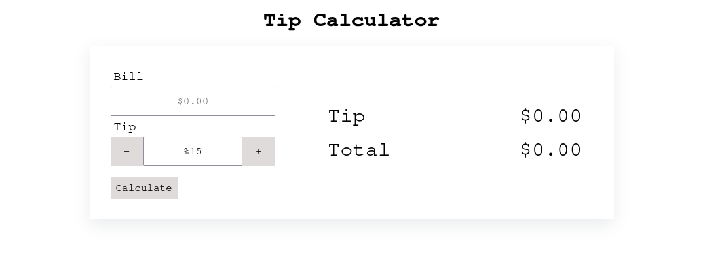

# 💰 Tip Calculator

A clean, responsive tip calculator built with **HTML**, **CSS**, and **JavaScript**. This project was designed to help users quickly calculate a tip and total bill amount based on a custom percentage.

---

## 🚀 Live Demo

👉 [View the live project](https://osivff.github.io/tip-calculator/)  
_(Oscar Fitch Github)_

---

## 📌 Features

- 🧾 Enter a bill amount
- ➕ / ➖ Adjust tip percentage
- 💸 Click **Calculate** to get:
  - Tip amount
  - Total bill including tip
- 🧼 Input validation and user-friendly error handling
- 💻 Responsive layout and clean UI

---

## 🧰 Tech Stack

- **HTML5**
- **CSS3** (with Modern Normalize)
- **JavaScript (Vanilla)**

---

## 🎯 Goals of the Project

- Practice working with forms and real-time DOM updates
- Handle user input and perform basic validation
- Improve layout styling with Flexbox
- Build a clean, user-focused tool in under 100 lines of code

---

## 🧠 Future Improvements

- [ ] Add mobile responsiveness
- [ ] Add option to split the bill among multiple people
- [ ] Light/dark mode toggle
- [ ] Save tip history using localStorage

---

## 👨‍💻 Author

Made with 💻 + ☕ by **Oscar Fitch**  
[GitHub Profile](https://github.com/osivff)

---

## 📄 License

This project is open source and available under the [MIT License](LICENSE).
